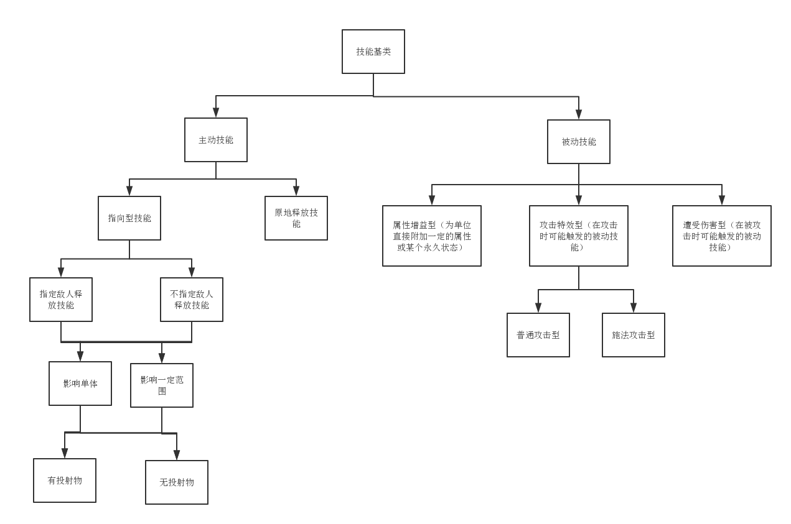
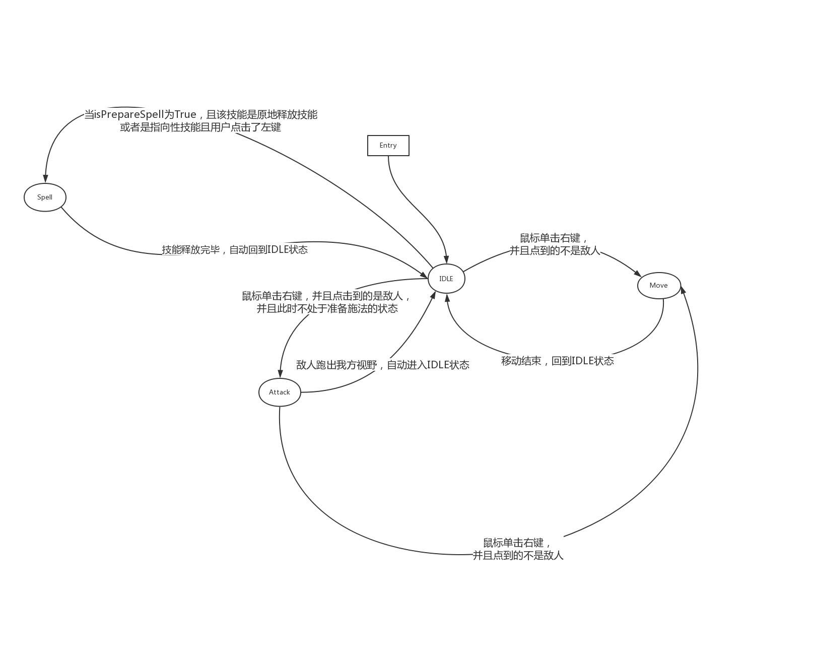

# 输入系统架构与描述 #
在本游戏中，我模仿了一部分魔兽争霸单位编辑器的方法来对单位、物品、技能对象进行编辑。
也就是，所有单位的数据都是先在编辑器中编辑好的，当编辑好后，这个数据就以（JSON、CSV、Sqlite、xml）的形式存储到了本地文件中。

在游戏代码中，通过读取这些本地文件，得到了一个个已经编辑好的单位、技能、物品的数据，通过这些数据来生成对象。
## 在外部如何组织数据 ##
我使用sqlite来进行外部组织数据，技能、单位、物品，都依据数据库表的方式进行存储。
## 如何将外部数据输入进Unity ##
采用了类似RPG Maker的笨办法

在游戏开始时对游戏数据进行初始化，即在游戏开始时，读取数据库，对所有游戏数据生成一个模板对象，用一个数组或字典存储。

接下来是问题的关键！

如何将这些Model对象赋值到他们各自的Mono类上！

这里我依然用一个笨办法，用一个MonoBehavior脚本，向他们的Mono类进行安装Model对象。

## 数据表组织 ##

### 单位 ###
单位表,保存单位的基本属性,如最大生命值,最大魔力值,单位名等等.

需要格外注意的是,单位拥有的[技能,物品]均是额外使用一个数据表来进行映射.
<table>
<tr>
<td>单位表(用于存储单位的数据)</td>
<td>描述</td>
</tr>
<tr>
<td>单位编号ID</td>
<td>主键</td>
</tr>
<tr>
<td>单位名Name</td>
</tr>
<tr>
<td>最大生命值MaxHP</td>
</tr>
<tr>
<td>最大魔力值MaxMp</td>
</tr>
<tr>
<td>普通攻击的距离attackDistance</td>
</tr>
<tr>
<td>基本攻击力attack</td>
</tr>
<tr>
<td>攻击类型attackType</td>
</tr>
<tr>
<td>基本防御力defense</td>
</tr>
<tr>
<td>防御类型defenseType</td>
</tr>
<tr>
<td>移动速度movingSpeed</td>
</tr>
<tr>
<td>转身速度turningSpeed</td>
</tr>
<tr>
<td>投射物编号(以编号存储单位对应的投射物,如果编号为-1,则表示该单位没有投射物)  projectile</td>
<td>外键</td>
</tr>
<tr>
<td>单位等级Level</td>
</tr>
<tr>
<td>基本回血速度restoreHpSpeed</td>
</tr>
<tr>
<td>基本回魔速度resotreMpSpeed</td>
</tr>
<tr>
<td>单位类型unitType(普通单位,英雄单位,无敌单位,守卫单位等等)</td>
</tr>
<tr>
<td>单位所属阵营unitFaction(红方,蓝方,中立方,敌对方等等)</td>
</tr>
<tr>
<td>单位被杀死后提供的经验supportExp</td>
</tr>
<tr>
<td>单位被杀死后提供的金钱supportMoney</td>
</tr>
</table>

### 技能 ###
emmmmmmmmmmmmm,如何设计技能表绝对是一个难题了,各个技能抽象的程度不一样,对外开放的接口也不一样.

在这里,我决定采用JSON的方式来存技能数据.

在JSON数据中,有一行数据,SkillType,技能类型,用于表示这个技能是什么类型的技能.在技能编辑器中(使用Unity Editor进行制作)根据这个SkillType来进行反射,生成对应的技能类,并在编辑器中生成这些技能类的可编辑字段.

而对于存储的JSON数据,则使用该技能开放的接口对应的属性进行存储.

简单的举个例子,目前我有两个技能,分别是召唤技能a和指定目标伤害技能b. 存储到JSON中格式就是这样的.
	
	{
		"SkillList":[
			{
				// 此处是一号技能,伤害技能
				"Damge": 100,
				"selfEffect":"001"		// 这里存储的是对应prefab在resources/skillEffect/下的名称
				"targetEffect":"002",
				"skillName": "伤害技能",
				"iconPath": "001",		// 这里存储的是对应texture在resources/texture/下的名称
				"description":"这是一个伤害技能",	// 存储描述
				"mp" : 100,		// 消耗mp
				"skillType": "PointingSkill"	// 描述这个技能的类型,用于反射
			},
			{
				// 二号技能,召唤技能
				"Summoner":"001",		// 这里存储的是对应prefab在resources/Character/下的名称
				"skillName": "召唤技能",
				"iconPath": "002",		// 这里存储的是对应texture在resources/texture/下的名称
				"description":"这是一个召唤技能",	// 存储描述
				"mp" : 100		// 消耗mp
				"skillType": "SummerSkill"
			}
		],
		"SkillCount":2
	}

# GamePlay数据类 #
　　简单说明一下,在GamePlay数据类中,有许多数据都是要由外部输入的,到时会有一个全局的 “字典/列表/队列” 等来管理所有数据。

　　对于一个由外部输入的数据,在定义属性时,使用注释 "<==" 来说明,对于在游戏中依据某些数据动态生成的数据,则不使用此注释. 

## GamePlay数据类中的Model类和Mono类 ##
在我设计的GamePlay游戏逻辑类中，有Model类和Mono类这两种，其中Model类是相当于Java里面的JavaBean那种感觉，主要就是用来存储从外部导入进来的游戏数据，比如技能、物品、人物数据等。而Mono类对应的是Unity里面的MonoBehaviour类，主要用来管理游戏进程的。

举个例子，对于投射物，有projectileModel和projectileMono类，其中Model类是用来存储从外部导入的投射物数据，比如在外部数据库编辑好的某个投射物，他的射速、射线弧度、投射物到达目标地点后产生的屏幕特效、投射物与敌人碰撞后产生的屏幕特效等。

而对于Mono类，则用来管理一个具体的游戏里面的投射物的生命周期，在Mono类中，管理投射物造成的伤害计算、向目标飞过去的逻辑等等。

每个Mono类中都有一个对应的Model类充当他的属性。

### 为什么要引入看起来变扭的Model类和Mono类 ###
因为平常都是从游戏外部通过 sqlite、csv、json 来导入数据进Unity的，然后导入的数据需要用一个新建的对象来保存它，但是MonoBehavior对象是不能随意创建的，但是游戏逻辑的部分又关乎MonoBehavior类，就是挂载到游戏对象上的类必须继承自MonoBehavior，所以只好在中间新增一个Model类来充当外部数据与MonoBehavior类的中介者。

### Model类和Mono类应该遵循怎样的设计原则 ###
一般来说，Model类只需要存储从外部导入的游戏数据就好了，相当于一个中间的存储容器.

但是，我觉得稍微漂亮一点的写法是把一些关乎游戏数据计算的方法也写在Model类中,比如:伤害计算公式等等.

关于一些非数值计算的游戏逻辑,写在Mono类中,比如音效、动画的播放.

## 技能设置描述 ##

所有技能都在外处使用编辑器进行编辑，以（.json\\ .csv\\ .xml\\ .sqllit）的方式进行保存。
所有技能都会有特效动画的产生，特效动画还可分为立即释放型特效，投射型特效等，特效动画由外部进行指定，类型为GameObject，暂定以JSON的形式保存一个技能，其动画特效（释放时敌方产生的特效及我方产生的特效）是一个字符串类型，该字符串指定了在Resource/Prefabs/文件夹下的粒子特效预制体的名称。

## 技能 ##
### ***基类 BaseSkill*** ###
1. 属性
	 1. 技能名称 ： skillName : string  :  <==
	 2. 技能图标 ： Icon : string  :  <==
	 3. 技能描述 ： description : string  :  <==
2. 方法
	1. Excute(CharacterMono Speller,CharacterMono target) : void 执行该技能效果
### ***主动技能类 ActiveSkill < BaseSkill*** ###
1. 属性
	 1. 要消耗的魔法值 ： mp:int  :  <==
	 2. 基础伤害 ： baseDamage:Damage  :  <==
	 3. 附加伤害 ： plusDamage:Damage  :  <==
	 4. 热键 ： keyCode:KeyCode  :  <==
	 5. 技能CD时间 ： coolDown:float  :  <==
	 6. 施法距离 ： spellDistance:float  :  <==
	 7. 最后一次施法的时间 ： finalSpellTime:float
2. 方法
	1. Execute() : Damage 计算伤害
### 技能分类 ###

	 
## 技能系统架构描述 ##
对于技能系统的编写,有几个标准:

1. 能不强转就不强转
2. 能不判断类型就不判断类型 
### 自然语言描述 ###
先用直白的自然语言描述一下技能系统，对于一个技能，它有两个大的分类，分别是：

1. 主动技能
2. 被动技能

可以将技能Skill类看成是Model和Mono类的结合类(实际上并不继承MonoBehavior,只是为了表示这个类封装了游戏逻辑),它即保存数据,又对战斗逻辑(释放技能后产生怎样的效果-这样的逻辑)进行计算.

#### 主动技能 ####
对于任何一个主动技能，它最重要的几个属性是：

1. 造成的伤害 Damage
2. 施法距离 SpellDistance
3. 技能影响范围(以r为半斤的一个圆型区域) skillInfluence
4. 释放技能后,施放单位产生的特效
5. 释放技能后,目标地点/敌人产生的特效

它最重要的方法以下几个:

1. public virtual void Execute(CharacterMono Speller,CharacterMono target)
2. public virtual void Execute(CharacterMono Speller,Vector3 Position)

Execute方法表示应用此技能的特效,即 施法开始-产生特效-造成伤害这一系列操作.更准确的说,这个virtual方法使得技能类几乎可以实现所有效果,只要后面的子技能类重写就OK了.

对于施法者来说,他不关心目前释放的技能是"主动技能类的哪个子类",他只要在释放技能的时候,执行Execute方法,就会自动执行不同的技能特效.

#### 被动技能 ####
对于一个被动技能,它最重要的几个属性是:

1. 触发类型(说明了此被动技能在什么情况下被触发)
2. 冷却时间(为0表示此被动技能不具有冷却时间)
3. 耗魔(为0表示此被动技能不耗魔)

重要的方法是:

1. public void Execute(CharacterMono Speller)

Execute方法的基本思路和主动技能类似,这里不再赘述.
与主动技能相比,被动技能多了一个触发类型的属性,因为被动技能不能由单位主动释放,只能在某些特定条件触发的情况下,自动进行施法,与主动技能类的设计类似,被动技能类通过覆写多个子类,可以产生很多效果,而对于被动技能的施法者来说,它不需要知道这些效果的细节,只需调用Execute方法就OK了.

#### 被动技能的类型 ####
被动技能相较于主动技能有许多特殊的地方，这一切都是因为它拥有 “触发条件” 。为了响应这些触发条件，代码里面可能会零散的出现一些被动技能触发的语句，如 普通攻击的时候，遭受伤害的时候。

下面简单列举一些比较特殊的被动技能，以及如何触发他们：

1. 伤害变更型被动技能，技能典型：“致命一击”  
这种被动技能一般会在某种特殊的情况下对单位造成的伤害进行提升或减少，在这种情况下，单位进行攻击时，会首先对普通攻击的伤害进行计算，得到一个Damage类，同时，轮询单位身上每一个被动技能，对伤害是否提升进行计算，对于不对伤害进行任何改变的被动技能，它的public Execute(CharacterMono speller,ref Damage damage)实现为空。
2. 直接伤害型技能，技能典型：“反击螺旋”  
这种被动技能会在某种特殊情况下，直接对周围敌人造成伤害，较好实现。 

### 技能类的子类 ###
技能类的多个子类是实现多种多样技能效果的关键,对于技能类的每个子类来说,他都会实现父类的Execute方法,同时,会留下参数(接口)供外部调整,这些参数就是这些子类的一些属性,比如召唤类技能,则可以调整它召唤的单位等等.

## 伤害系统的设计 ##

1. 所有单位受到的伤害都必须由Damage类提供,在代码中不允许出现 HP -= xxxx 这样的字眼.
2. Damage类是值类型
3. 某些被动技能拥有提升伤害的特性，对于这些被动技能，在计算完攻击 or 法术伤害后，再依次计算各个被动技能对伤害的提升。
4. Damage类本身用于计算伤害的属性皆为Float属性，但是，当要具体拿出来计算时，全部都使用Floor强转为int型。

## 物品系统设计 ##
### 功能描述 ###
在MOBA游戏中，一个物品有多种功能。下面简单举例：

1. 作为消耗品，为英雄进行补血等操作
2. 作为装备，为英雄提供属性或特技
3. 作为某些永久性使用物品，给英雄进行使用

可以看出物品其实可以看成是拥有一堆主动、被动技能的物体，只要携带在英雄身上（物体未消耗完毕），英雄就可以使用这些主动、被动技能。

### 物品类（Item）属性 ###
1. 单个物品可持有最大数量  MaxCount : int  :  <==
2. 物品类型（如：消耗品，装备等等） ItemType : ItemType  :  <==
3. 拥有的主动技能 ItemActiveSkill : ActiveSkill  :  <==
4. 拥有的被动技能 ItemPassiveSkills  : List<PassiveSkill>  :  <==
5. 物品名  ItemName : string  :  <==
6. 物品价格  ItemPrice : int  :  <==
7. 物品购买间隔时间（多次购买同一物品需要等待的时间）  ItemPayInteral : float  :  <==

### 物品格子类（ItemGrid）###
物品格子类是物品的类的包装类型，它表示了在英雄物品栏中的一个个物品格子，其拥有当前物品持有数量等属性，用来处理具体的游戏逻辑。

1. 物品 ： Item
2. 持有该物品的数量 count : int
3. 使用该物品的热键 hotKey : keycode 

## 状态系统设计 ##
### 功能描述 ###
状态是一种持续影响某一物体的表现，最典型的状态比如：中毒、伤害加深。  
当单位受到中毒状态时，他会每隔一段时间受到一定比例的伤害。  
而当单位受到伤害加深状态时，他会在遭受攻击时，受到的伤害加深。  
更为特殊的状态，当单位拥有某一种特殊状态时，它的攻击会带有某种特效之类的。

从上面的描述中，可以看出状态有以下特点：

1. 持续性的影响某一单位，当时间超过某一限度，此状态将会消失
2. 除了持续性的影响外，还可能带有某些特殊效果，这些特殊效果可能会在状态持有者 攻击时、遭受伤害时等情况下触发

### 实现思路 ###
根据功能描述，可以把状态看成是一个在Update状态不停作用单位的一种Mono类。

但是，对于状态拥有的某些特殊功能，仅仅是上面这些还不够。对于状态的特殊效果，可以看出它的描述特别像被动技能。

在这里，可以将状态定义为：

1. 在Update状态下不停作用物体
2. 拥有一系列被动技能作用物体

### 状态（BattleState）属性 ###
1. 状态名 stateName : string  :  <==
2. 状态描述 description : string  :  <==
3. 状态持续时间（单位:秒）（为0表示状态永久存在） duration : float  :  <==
4. 状态拥有的一系列被动技能 statePassiveSkills : List<PassiveSkill>  :  <==
5. 状态持有者会产生怎样的特效 stateHolderEffect : GameObject  :  <==

### 状态（BattleState）重要方法 ###
1. public virtual OnEnter(CharacterMono stateHolder)
2. public virtual OnUpdate(CharacterMono stateHolder)
3. public virtual OnExit(CharacterMono stateHolder)

状态的运行流程如下：

1. 当某一单位被施加了某一状态，首先进入该状态的OnEnter方法
2. 在每一帧更新时，进入状态的OnUpdate方法，同时，在OnUpdate方法中判断状态持续时间是否到头，如果持续时间已经过了，那么自动执行OnExit方法
3.  状态消失时，自动执行OnExit方法
   

## 单位 ##
需要明确的是，每一个单位都在外部由编辑器提前设定。
### 普通单位Character ###
1. 属性
	1. 血量 HP：int  :  <==
	2. 魔法值 Mp：int  :  <==
	3. 最大血量 maxHp：int  :  <==
	4. 最大魔法值 maxMp：int  :  <==
	5. 名称 name：string  :  <==
	6. 攻击距离 attackDistance：float  :  <== 
	7. 该单位拥有的所有技能 baseSkills：List< BaseSkill >  :  <==
	8. 该单位拥有的所有主动技能 activeSkills ： List< ActiveSkill >
	9. 该单位拥有的所有被动技能 passiveSkills : List< PassiveSkill > 
	10. 攻击力 attack ： int  :  <==
	11. 攻击类型 attackType ： AttackType  :  <==
	12. 攻击间隔（以秒为单位，每经过一段攻击间隔，便进行攻击一次） attackSpeed : float  :  <==
	12. 防御力 defense ： int  :  <==
	13. 防御类型 defenseType ： DefenseType  :  <==
	14. 移动速度 movingSpeed ： int  :  <==
	15. 转身速度 turningSpeed ： int  :  <==
	16. 投射物 projectile ： Projectile  :  <==
	17. 等级 level ： int  :  <==
	18. 回血速度 restoreHpSpeed : float  :  <==
	19. 回魔速度 restoreMpSpeed : float  :  <==
	20. 是否可被攻击（无敌） canBeAttacked : boolean  :  <==
	21. 单位类型 unitType : UnitType  :  <==
	22. 单位阵营 unityFaction : UnitFaction  :  <==
	23. 单位被杀死后将提供给英雄单位多少经验 supportExp : int  :  <== 
	24. 单位被杀死后将提供给玩家单位多少金钱 supportMoney : int  :  <== 
	
---
### 英雄单位 Hero < Character ###
1. 属性
	1. 力量 forcePower : float  :  <==
	2. 力量成长 forcePowerGrowthPoint : float ：  <==
	2. 敏捷 agilePower : float  :  <==
	3. 敏捷成长 agilePowerGrowthPoint : float  ：  <==
	3. 智力 intelligencePower : int  :  <==
	4. 智力成长 intelligenceGrowthPoint : float  :  <==
	4. 技能点 skillPoint : int  :  <==
	5. 技能点成长 skillPointGrowthPoint : int  :  <==
	5. 经验值 exp : int
	6. 经验值因子（每次升级所需经验值关联系数） expfactor : float  :  <==
	7. 升级所需经验值(指第0级升到第一级所需经验) needExp : int  :  <==

### 英雄单位相比普通单位有什么区别 ###

1. 更多的属性
2. 杀死怪物后获得经验
3. 当经验到达阈值，升级
4. 升级后，获得技能点，同时智力、敏捷、力量等进行成长
5. 拥有物品栏
6. 使用技能点可以学习技能 

---
### 特殊单位 投射物Projectile < Characte[canBeAttacked=false] ###
投射物是一个比较特殊的单位，在一些技能和单位的远程攻击里面出现，投射物一般有一个目标位置。

该投射物到达指定地点后会产生一个球形伤害。

#### 投射物的伤害计算 ####
要明确的一点逻辑是，投射物本身是不具有伤害的，具有伤害的是发出投射物的单位，所有投射物都是由单位（继承自Character的所有子类）产生的，由该Character类指定伤害，也就是Damaged，投射物在计算伤害时，直接使用该Damaged类来计算伤害。

对于一些攻击，如普通攻击等，需要计算敌我的防御值、攻击值，才能产生伤害，这些都是由Character类做的事情，当Character做完这些事之后，将产生的Damaged伤害类传递给投射物就OK了。

#### 投射物属性 ####
1. 目标位置 targetPosition : vector3
2. 目标敌人 target : CharacterMono
3. 移动速度 speed : float  :  <==
4. 投射物到达指定地点时产生的特效 targetPositionEffect : GameObject  :  <==
5. 投射物击中敌人时,在敌人身上产生的特效 targetEnemryEffect : GameObject  :  <==
#### 投射物的飞行轨迹 ####
对于一个投射物来说，他有两种飞行轨迹：  
　　　　　　一种是平的，也就是直接从某处平移到某处,这种飞行轨迹容易实现,只需让投射物对着目标地点进行均匀的平移就可以了  
　　　　　　一种是有弧线的,这种飞行轨迹一般用于弓箭、炮弹、飞行生物降落的攻击等投射物上,这种飞行轨迹较难实现,因为对于弓箭这种投射物,它的旋转角度也会发生改变,对于从高处降下,目前的想法是给物体增加刚体组件
## 战斗系统规则 ##
### 判定伤害 ###
1. 对于普通攻击来说，只有当一个人物动作完整的播放完攻击动画时，才对对面给予伤害，最终伤害判定根据被攻击者和攻击者的距离来判定（这里针对近战攻击），距离每超过攻击者的攻击范围的10%，被攻击者的闪避率增加10%。
2. 所有伤害判定均由"**伤害类**"来进行判定，所有普通攻击，伤害技能....等等，最终都会产生伤害类，由伤害类来判断最终给予目标的伤害。
3. 对于拥有投射物的单位，其攻击逻辑与直接造成伤害的不一样，当攻击动画播放完毕后，会自动在发射点创建一个投射物向敌人进行移动，当投射物碰到敌人时，造成伤害。
### 技能 ###
1. 所有技能都有一个基类，基类Skill包含了技能的基本特性，如：造成的伤害，出现的状态等等，拥有一个通用的用于计算技能伤害的方法，该方法将会产生一个伤害类，并执行此伤害类。
2. 技能细分下来，分为主动技能和被动技能,主动技能中分为指向性技能、原地释放技能等等，这些分为的种类，都各自写一个类。
3. 对于技能的编辑，到时可以撸一个类似Rm的技能编辑窗口，这个窗口最终将编辑好的技能保存为Json、CSV、sqlite等数据集合

# AI设计 #

### ● NPC部分 ###
---
### 守卫型NPC行动分析（如：防守塔，野区野怪） ###
1. 基本操作有:攻击、移动、返回原地点
2. 攻击：当此NPC周围出现敌人时，自动对此敌人进行攻击，在这里分为两种情况。
	1. 对于有移动能力的守卫NPC，将对目标进行追击，直到目标跑出视野，返回原区域
	2. 对于没有移动能力的守卫NPC，则对目标进行攻击，当目标跑出攻击区域，自动停止攻击
3. 移动：这里针对有移动能力的NPC，当此NPC周围出现敌人时，对该敌人进行追击。
4. 返回原地：当此NPC周围没有敌人时，自动返回原本的根据地。

### 进攻型普通AI行动分析（如：固定出兵攻打敌方基地的小兵） ###
1. 基本操作：攻击、移动
2. 行为描述：
	1. 小兵从固定地点产出
	2. 小兵按照 3塔、2塔、高地塔、基地的顺序对敌方进行进攻
	3. 小兵按照固定的路线向地方前进
	4. 当小兵在移动中发现敌人时，将敌人消灭后继续前进
	5. 小兵毁灭3塔后，向2塔前进，毁灭2塔后，向1塔前进，毁灭1塔后，向基地前进，基地毁灭，阵营胜利。
3. 逻辑分析：

（伪码）

	if(周围有敌人)：
		消灭周围敌人
	else:
		进攻3、2、1塔、基地
	

### 处理人物死亡逻辑 ###
当人物HP降为0时，人物死亡。
进入死亡状态的单位，停止目前一切动作，播放死亡动画，同时设置isDying为true，表示人物正在垂死状态中，当死亡动画播放完毕后，Destory该单位。（这个Destory可以有多种意思，在有对象池的情况下，这个Destory可能仅仅只是收回对象回池内而已）

### ● 玩家部分 ###
---
### 人物行动分析 ###

1. 基本人物操作有：攻击、移动、施法、吃药、换装备。
2. 移动：鼠标对某处点击右键，当目标不是敌人时，进行移动操作。移动开始时，播放移动动画，显示移动特效，移动结束后，移动动画结束播放。
3. 攻击：当鼠标对某处点击右键且目标是敌人时，进行攻击操作。
	1. 攻击操作准备开始时，首先判断主角当前位置和敌人的距离是否是可以攻击的距离，如果不可以攻击，那就移动到目标敌人的位置上进行攻击，如果可以攻击，那么进行攻击操作。
	2. 当追击敌人的时候，如果敌人跑出视线范围，那么就自动放弃追击。否则会一直穷追不舍。
	2. 攻击开始时，播放角色攻击动画，此时进行逻辑判断，当角色攻击动画完成后（这里有近战及远程攻击的区别），对敌人进行伤害处理。
4. 施法：当按下某个未在冷却中且为主动技能的法术时，进行施法操作。（暂时只考虑指向敌人型技能和原地释放技能）
	1. 施法操作准备开始时，鼠标变换图片，变成一个带有指向性的攻击图标。
	2. 鼠标指针图标变换完成后，鼠标右键单击敌人，开始施法。
	3. 施法开始时，判断是否有施法时间 。
		1. 有的话，播放持续施法动画，持续施法动画播放结束后，进入2。
		2. 没有的话，播放施法动画，判断施法动画是否结束，当施法动画结束后，播放我方特效动画以及敌方特效动画，对伤害进行结算。（此处伤害结算包含了立即型伤害以及放一个触发器去碰敌人然后使敌人受到伤害）
5. 吃药：可以将药品理解为消耗性技能，其判断与施法大体是相同的，同样是判断按键，同样是吃药动画、伤害结算等等，唯一不同的地方是，吃药是可以把要吃完的。
6. 换装备：暂不实现。

### 尝试使用行为树 ###

　　写到一半,复杂度骤增,放弃.......................

---

### 尝试使用状态机 ###
#### 状态机注意事项 ####

#### 1.施法状态的编写 ####
施法考虑到技能有指向型技能（指向型技能又分为有必须单击敌人才能释放的单指向型技能和按照一定范围释放【类似WOW里面的"暴风雪"】的技能）与原地释放技能的区别.

所以在anyState的状态更新中判断用户是否按下了释放技能的按键(关于技能冷却,是否够mp放技能,都可以放到anyState的OnUpdate里面判断).当用户按下释放技能的按键且有足够条件释放技能时,设置CharacterMono中的prePareSkill技能类且使isPrePareUseSkill为True.

设置anyState状态状态的Transition类,该Transition定义了从anyState到Spell状态的规则.规则如下:

1. 当isPrePareUseSkill为True且释放的技能为原地释放技能时,进入Spell状态,设置isImmediatelySpell为True

2. 当释放的技能为指向型技能时(暂时不划分单指向型技能和范围指向技能),当玩家用鼠标单击敌人的时候,进入Spell状态,设置isImmediatelySpell为False

#### 2.施法状态的转移 ####
需要注意的是,施放技能状态和其他状态最大的不同是,施放技能状态会自动结束,并回到Idle状态.

#### 3.状态机图片 ####

# 战争迷雾设计 #
## 原理 ##
生成一张全黑的贴图,在贴图上挖洞造成战争迷雾的效果.
## 问题 ##
1. 贴图怎么生成
2. 什么时候更新贴图
3. 带有视野的单位怎么更新贴图
4. 多个带有视野的单位怎么互相作用
5. 如何将生成好的贴图渲染到屏幕上
## 解决方案 ##
1. 
# 开发日记 #
### 2018/10/7 ###
#### Question ###
　　①现在面临的问题是,怎么将表示游戏数据类的Model类和表示UI的View或ViewModel类绑定到一起,达到Model类的属性改变,视图也一起改变的效果.   
　　比较蛋疼的是,不能把Model类写成ViewModel类的样式,不然后面写起来会特别麻烦并且可能会出现意料之外的问题,同时,不能用BinableProperty修饰Model类的属性,因为Model类是要存储从外部输入的游戏数据,如果使用BinableProperty来修饰,又要涉及到一些问题.

　　②要对AI和游戏逻辑进行一次分离,也就是说,人物攻击,施法,造成伤害,移动,这些都是人物本身的游戏逻辑,跟AI本身没什么关系,完全不用写在"行为树/状态机"里面,所以在这里要分离AI的逻辑和基本逻辑,让游戏逻辑写在Mono类里面,而AI到时需要攻击时,只需要调用Mono类的Attack方法就行了,不需要在行为树/状态机里面费劲的进行播放动画,计算伤害等操作.  
　　这里有个比较蛋疼的问题,一开始我是根据动画是否播放结束来判断伤害的,当人物动画播放结束时,对敌人造成伤害。但是这样做有一个问题，一个单位的攻击速度特别依赖于他的
#### Answer ####
　　①用了一个比较拙劣的方法,就是,在Model和ViewModel之间再加一层绑定.  
　　也就是,当Model对象的值改变的时候,ViewModel的值也一起随之改变,然后由于ViewModel的改变,导致视图View的变化,这样就使得Model类和View视图类有了一个间接的绑定.  
　　好吧,我知道这有点脱裤子放屁的感觉.........

### 2018/10/10 ###
　　到目前为止,大致完成了:

1. 玩家用于操纵人物的状态机,可以实现的操作有:移动,攻击,施法
2. 野怪,守卫,进攻型小兵的简单行为树设计.
	1. (野怪,守卫)可以做到:判断周围是否有敌人,当存在敌人时攻击,当敌人攻击完毕后,返回原始地点
	2. 进攻型小兵可以做到:当周围有敌人时,消灭敌人,当没有敌人时,进攻敌方基地
3. 头顶血条的View(将CharacterModel与UI的hpImage条进行绑定)
4. 人物详细View,技能详情View.
5. 单位类,技能类的基本架构,所有单位受到伤害都不能直接减去hp,必须由一个Damage类来对单位造成伤害.
6. 单位的死亡逻辑处理

#### 大致完成了游戏的第一阶段了. ####
#### 接下来攻克网络对战方面。同时，在学联机的同时，一步步完善游戏系统，接下来的完善方向是： ####

1. 优化死亡逻辑，死亡后应有死亡动画，尸体，尸体消融，骨头等现象，同时，垂死的、已死的单位不允许任何单位对其进行攻击，其本身也无法进行任何操作。
2. 完善人物状态机，当人物处于IDLE状态时，如果周围有敌人，会自动进入攻击状态对敌人进行攻击。
3. 定义三路小兵（上中下）的行走路径，如上路小兵只能走上路，同时小兵不会穿树林
2. 完善技能系统，目前技能系统只有两种类型的技能，即：原地释放技能，指向型技能，被动技能，而实际上，moba游戏的技能是相当多样性的，要善于对其进行抽象，提炼出几大类型出来，然后制作特殊类，同时要留一个接口。
3. 制作英雄系统，英雄单位异于小兵单位，其拥有以下几种能力:
	1. 拥有经验值，且可以升级，升级后，各项属性提升，并获得技能点
	2. 拥有技能点，使用技能点可以学习技能
	3. hp为0并不会真正的死亡，而是等待一段时间后系统将其复活
	4. 死亡后独特的英雄死亡动画
	5. 可以使用物品并穿戴装备
4. 制作物品（消耗品）系统及商店系统，基本思路与技能系统类似。
5. 状态系统
5. 制作装备系统，包括完整的装备合成树系统 
6. 制作战争迷雾系统
7. 网络对战系统,包含:网络大厅,加入房间,开始游戏等等操作

### 2018/10/19 ###
大致将2018/10/10列出的前8点的系统进行了制作与完善,接下来就是数据的问题了.

目前的要解决的问题是:

游戏中大部分数据都是由外部输入的,我在设计类的时候也有想过这一点,但是,有这么一个问题,那就是----怎样**方便,易读,易修改地** 读取在外部使用 csv,json,spllite保存的数据，同时，还有一个问题就是，在游戏运行时，**如何获得这些数据，是初始化时统一进行读取，然后像rpgMaker的处理方式一样，存到一个数组里面去，还是在游戏运行时去访问数据库获得信息**，这点值得商榷。

总结一下这两个问题：

1. 如何方便，易读，易修改的设置，读取数据
2. 如何在游戏运行时，高效地读取数据

### 2018/10/28 ###
这段时间去学战争迷雾系统了，大致写了一个多线程的战争迷雾系统，不影响主线程帧率，勉强可以用用。

这样一来，就完成了第一阶段中的前9点了（装备系统没做）。

因为这是练手的项目，所以打算在里面加一些乱七八糟的东西练练手，下面列举一下这段时间想了一下可以往MOBA Demo里面加的东西：

1. 类似暗黑的装备系统，在本游戏不采用魔兽或者Dota那种装备放到物品栏就生效的系统，这里做成类似暗黑那种，每个部位有个装备那种系统。
2. 前缀装备系统，类似暗黑那种，什么中毒加深的、生锈的，之类的。
3. 技能树系统，每个单位都有自己的一套技能树，技能树的技能肯定是点不完的，所以需要玩家好好斟酌

上面这些系统不急着做，目前写完基本MoBa游戏需要的要素就可以了。

**接下来，明确一下接下来的方向：**

1. 布置场景，布置好一个简单的MOBA类的场景，也就是，3条路，3座塔，基地设施
2. 完善小兵AI，目前小兵会追着他遇到的第一个人打，这是不合理的，到时候结合规划器进行完善
3. 完善英雄系统
4. 完善技能树系统
5. 完善装备合成树系统
6. 完成商店系统
7. 完善外部数据输入的编辑器系统

目前与Dota还差：

1. 小地图
2. 经济系统（商店系统）
3. 摄像机移动
4. 场景布置
5. 敌人AI
6. 英雄AI
7. 英雄属性介绍视图，技能介绍视图，物品介绍视图，状态介绍视图，（其中技能和物品的可以写成一个）